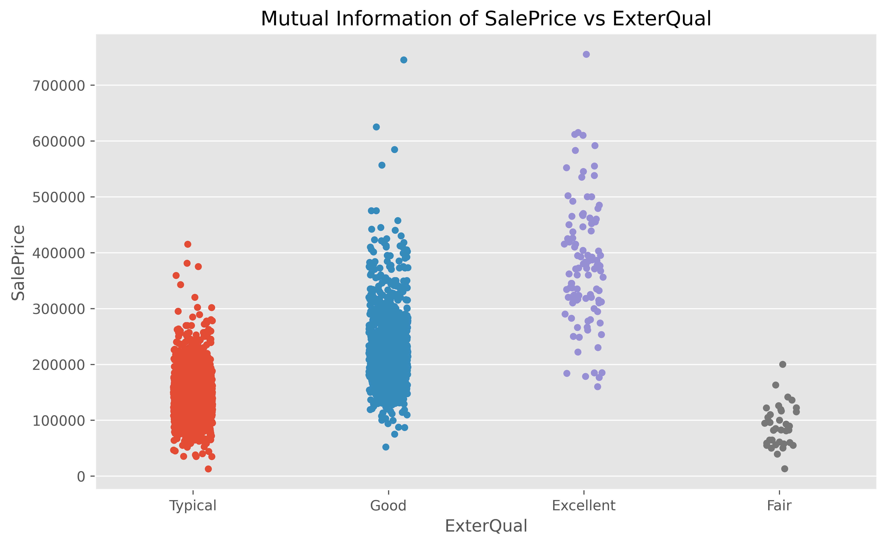
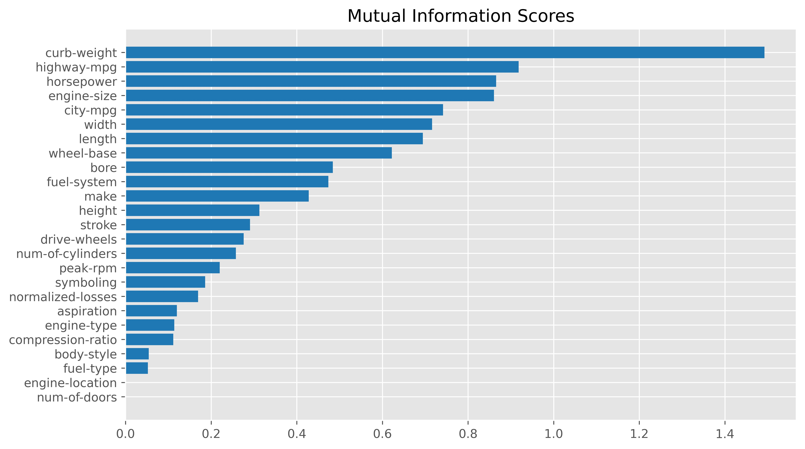
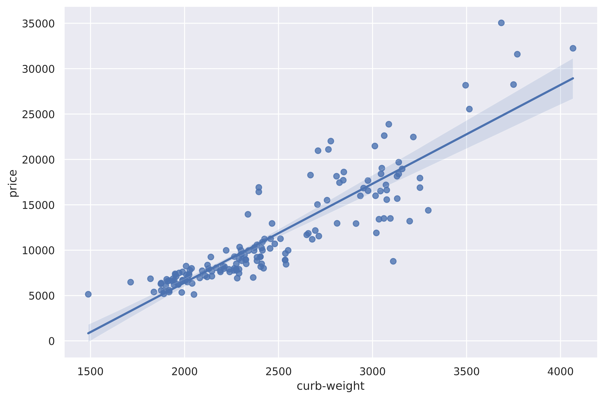
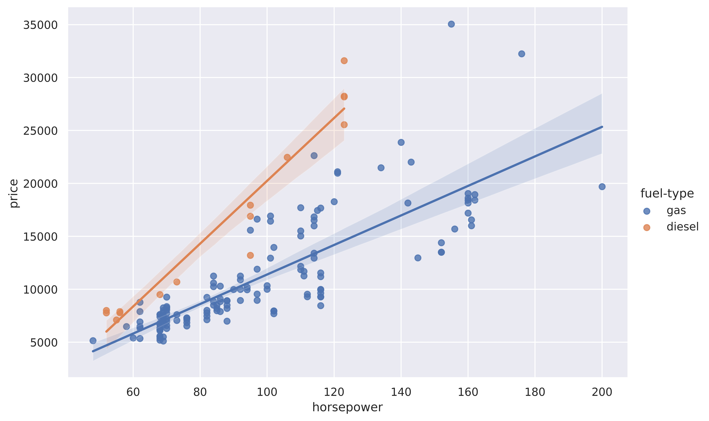
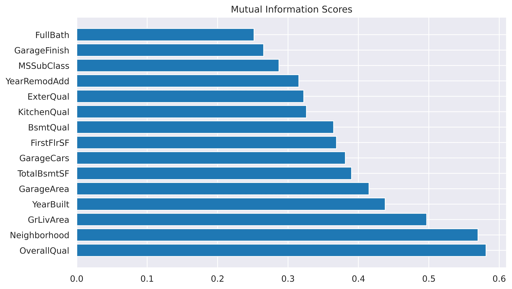

# Feature-Engineering

Part 1
---

Overview:

Dataset: concrete.csv

Model: Random Forest Regressor

Evaluated score by cross-validation

Metric: Mean absolute error

Error before creating 3 features: 8.2317

Error after creating 3 features: 7.8215

Observation: Adding informative features can increase the performance of the model.

Part 2
---

Objective: Identifying and ranking relevant features w.r.t target

Metric: Mutual Information (MI) -> It describes the relationships in terms of uncertainty. MI between two quantities is a measure of the extent to which knowledge of one quantity reduces uncertainty about the other. That is, if we know the value of a feature, how much more confident would we be about the target? Uncertainty is measured using "entropy". The least possible MI is zero, the maximum possible MI is infinite, since MI is a logarithmic quantity it increases very slowly (above 2.0 are uncommon).

Remember: MI cannot detect the interaction between features, for that we can create new features (combining other features) and calculate its MI. MI is a univariate metric.

Example: Mutual Information between ExterQual and SalePrice

Dataset: Ames Housing

<!--  -->

Observation: We can observe the relationship between the feature "ExterQual" and the target, "SalePrice". We can interpret the plot as follows. Knowing the value of the ExterQual feature makes us more certain regarding the target. Because, each category in ExterQual roughly separates the range of Sale Price, helping the model to use this information to improve its performance.

Dataset: Automobile_data

Metric: Mutual Information

Observation: MI score for each feature in the dataset w.r.t the target. The higher the MI score, the better is that feature to predict the price of the car, i.e. the relationship is strong!

Observation: Plotting the relation between curb-weight and price by fitting a linear regression to curb-weight and price. As curb-weight increases, the price also increases. This shows strong relation, as also shown by Mutual Information Score

In the figure above we are answering the question, how does the relationship between these horsepower and price change when fuel_type is taken into consideration?

Observation: As we have seen in the MI scores, fuel_type has a relatively low score. But from the plot, we can see that two price populations are seperated by fuel_type with trends within the horsepower feature. This indicates that fuel_type contributes an interaction effect and might be important also.

Action-> We can create another feature that has an interaction between horsepower and fuel_type (either addition, multiplication, or some other approach) we can verify which interaction works best by observing the MI score of the new feature.

---

Dataset: Ames. Target SalePrice

Observation: In the above plot we can observe the relationship between the target and 6 other features. This plot will help to show how these 6 features are related to the target. Ultimately we can say that the feature YearBuilt, GrLivArea, and GarageArea has a strong relationship with targets. These three feature follows a pattern that separates the target i.e. SalePrice

Action -> Based on how strong the relations are we can be confident that these features are important to predict the SalePrice

Observation: Most informative features (top 15)

---

Reference: https://www.kaggle.com/learn/feature-engineering?rvi=1

